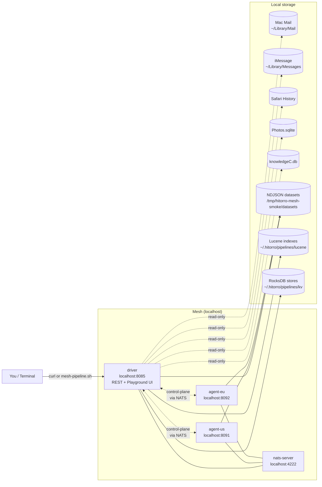
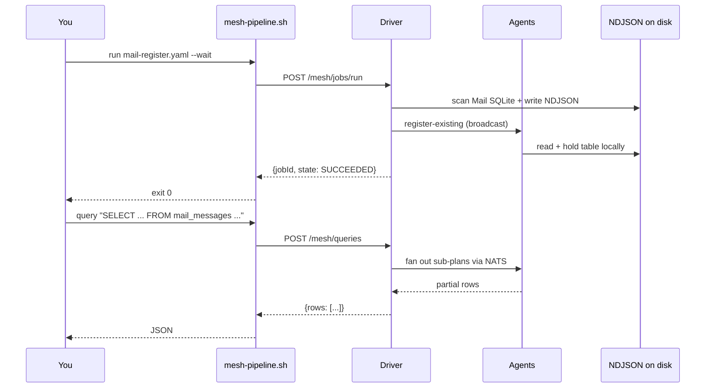
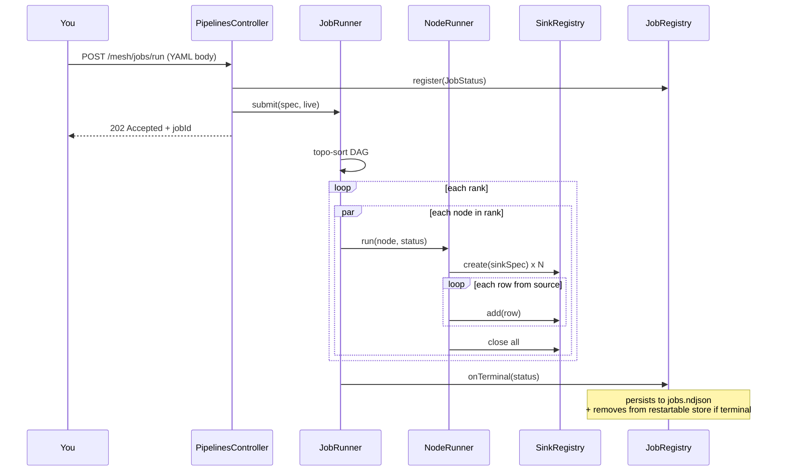
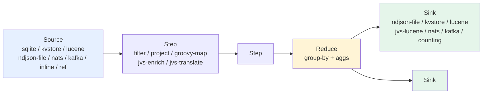
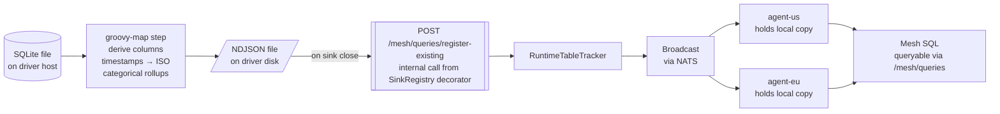

# Hitorro Mesh — Command-Line User Guide

Everything you can do from a shell with the mesh — starting the
cluster, running pipelines, querying data, tailing logs, debugging.
No UI required.

- [What you're driving](#what-youre-driving)
- [Bootstrap](#bootstrap)
- [Shell CLI: `mesh-pipeline.sh`](#shell-cli-mesh-pipelinesh)
- [Bundled YAML pipelines — full inventory](#bundled-yaml-pipelines--full-inventory)
- [Common workflows](#common-workflows)
- [Data flow diagrams](#data-flow-diagrams)
- [Logs, PIDs, working files](#logs-pids-working-files)
- [Debugging playbook](#debugging-playbook)

---

## What you're driving



- **NATS** is the control-plane bus — job dispatch, table
  register/unregister, agent heartbeats, inventory probes.
- **Driver** owns the REST surface + UI. All CLI commands + curl
  calls target `http://localhost:8085`.
- **Agents** (us, eu) hold table partitions + serve SQL sub-plans
  when the driver fans a query out.
- **Read-only SQLite** sources (Mail, Messages, Safari, Photos,
  Screen Time) always execute **driver-local** — the file lives on
  this Mac, not on remote agents.

---

## Bootstrap

> **Verified end-to-end on macOS 15 (Sequoia).** Every subcommand in
> this guide was actually run against a live mesh with 344k+ real Mail
> messages, 13k iMessages, and the other four datasets registered —
> including error paths, exit codes, `--wait --events` streaming, and
> the schema-probe pattern in the debugging playbook.

All scripts live in `hitorro-mesh-examples/scripts/`.

```bash
cd ~/hitorro/hitorro-mesh-examples/scripts

# Start everything (nats + driver + agent-us + agent-eu)
./mesh-up.sh

# Health check
./mesh-status.sh

# Stop everything (idempotent — safe to run repeatedly)
./mesh-down.sh
```

`mesh-up.sh` needs:

- `nats-server` on `$PATH` (Orion ships one at `~/.orion/bin/nats-server`)
- Two jars pre-built:
  - `hitorro-mesh-driver-app/target/hitorro-mesh-driver-app-3.0.1.jar`
  - `hitorro-mesh-agent-app/target/hitorro-mesh-agent-app-3.0.1.jar`
- `HT_BIN` env var — hitorro checkout root (auto-detected if `~/hitorro/config/types` exists)

Rebuild both apps if source changed:

```bash
(cd ~/hitorro/hitorro-mesh-driver-app && mvn clean install -DskipTests)
(cd ~/hitorro/hitorro-mesh-agent-app  && mvn clean install -DskipTests)
./mesh-down.sh && ./mesh-up.sh
```

**Full Disk Access:** granting the JVM launcher (Terminal / iTerm2 /
IDE / bare `java`) Full Disk Access in
**System Settings → Privacy & Security → Full Disk Access** is
mandatory for any SQLite pipeline reading from `~/Library/…`. Without
it every job fails with `SQLITE_IOERR: Operation not permitted`.

---

## Shell CLI: `mesh-pipeline.sh`

```
mesh-pipeline.sh <subcommand> [args] [flags]
```

Pipe-friendly by default: single-line JSON to stdout when the FD
isn't a TTY. Decorative status ("`-> polling job-xxx…`") goes to
**stderr** so pipes stay clean.

### Subcommands

| Subcommand                 | What it does                                      |
|----------------------------|---------------------------------------------------|
| `run <file.yaml>`          | POST /mesh/jobs/run                               |
| `run-bundled <name>`       | POST /mesh/jobs/run/bundled/{name}                |
| `run-groovy <file.groovy>` | POST /mesh/jobs/run-groovy                        |
| `status <jobId>`           | GET /mesh/jobs/{id}                               |
| `events <jobId>`           | GET /mesh/jobs/{id}/events                        |
| `cancel <jobId>`           | DELETE /mesh/jobs/{id}                            |
| `list`                     | GET /mesh/jobs (recent runs)                      |
| `bundled`                  | GET /mesh/jobs/bundled (all shipped examples)     |
| `tables`                   | GET /mesh/queries/registered (runtime tables)     |
| `query "<SQL>"`            | POST /mesh/queries                                |

### Flags

| Flag              | Meaning                                                        |
|-------------------|----------------------------------------------------------------|
| `--pretty`        | pipe output through `jq .` (falls back to raw if jq missing)   |
| `--wait`          | poll until the job reaches a terminal state; exit 0/1          |
| `--events`        | with `--wait`, stream progress events to stderr as they arrive |
| `--distributed`   | hit `/run-distributed` — rejects SQLite sources                |
| `--json`          | force JSON-only stdout (auto when piped)                       |
| `--running-only`  | for `list` — only jobs in RUNNING state                        |
| `--limit N`       | for `list` — cap the result count                              |

### Exit codes

| Code | Meaning                                                     |
|------|-------------------------------------------------------------|
| 0    | Success (job SUCCEEDED with `--wait`, or REST returned 2xx) |
| 1    | Job reached FAILED / CANCELLED terminal state with `--wait` |
| 2    | Usage error (missing subcommand, bad file path)             |
| 3    | REST error (submit failed; no jobId returned)               |

### Quick examples

```bash
# Register Mac Mail, wait for terminal, exit 0/1
./mesh-pipeline.sh run ~/hitorro/hitorro-mesh-pipelines-sqlite/src/main/resources/examples/jobs/mail-register.yaml --wait

# Query top domains — pipe to jq
./mesh-pipeline.sh query "SELECT sender_domain_folded, COUNT(*) AS n FROM mail_messages GROUP BY sender_domain_folded ORDER BY n DESC LIMIT 15" --pretty

# Chain: submit, grab jobId, watch events
JID=$(./mesh-pipeline.sh run x.yaml | jq -r .jobId)
./mesh-pipeline.sh events $JID | jq '.[] | select(.kind == "progress")'

# Cancel every currently-running job
./mesh-pipeline.sh list --running-only --json \
    | jq -r '.[].jobId' \
    | xargs -I{} ./mesh-pipeline.sh cancel {}

# List all runtime-registered tables (excludes shipped datasets)
./mesh-pipeline.sh tables --pretty | jq -r '.[].name'
```

---

## Bundled YAML pipelines — full inventory

Every YAML below is directly runnable. Location paths are the
canonical source under a hitorro checkout; the same specs also ship
inside each module's jar and are discoverable via
`GET /mesh/jobs/bundled`.

### `hitorro-mesh-pipelines-sqlite/src/main/resources/examples/jobs/`

Local macOS SQLite databases. **All driver-local only** — SQLite
sources can't dispatch to remote agents.

| YAML                        | What                                                       |
|-----------------------------|------------------------------------------------------------|
| `mail-register.yaml`        | Materialise Mac Mail → `mail_messages` table               |
| `mail-index.yaml`           | Full-text index Mac Mail into Lucene                       |
| `mail-top-domains.yaml`     | Rollup: email volume per sender domain (mailchimp-folded)  |
| `mail-enriched-index.yaml`  | JVS enrichment (NER + POS + segmentation) → Lucene index   |
| `messages-register.yaml`    | iMessage / SMS → `messages_texts` table                    |
| `safari-register.yaml`      | Safari history → `safari_visits` table                     |
| `photos-register.yaml`      | Apple Photos → `photos_assets` table                       |
| `screentime-register.yaml`  | Screen Time / knowledgeC → `screentime_events` table       |

### `hitorro-mesh-pipelines/src/main/resources/examples/jobs/`

Shipped-in-core reference examples — cover every source / step /
sink kind at least once.

| YAML                              | What                                                          |
|-----------------------------------|---------------------------------------------------------------|
| `airports-groovy.yaml`            | CSV source + Groovy step — airports enriched with derivations |
| `airports-typed-enrich.yaml`      | Typed-schema enrichment on airports                           |
| `countries-triple-sink.yaml`      | Fan-out to counting + ndjson + lucene sinks                   |
| `distributed-fanout.yaml`         | Multi-agent fanout demo                                       |
| `distributed-reduce-pattern.yaml` | Mapper × reducer split via NATS shuffle-buckets               |
| `distributed-reduce-shuffle.yaml` | Reduce with hash-shuffle across agents                        |
| `enrich-and-index.yaml`           | Enrichment chain into a Lucene index                          |
| `enriched-articles.yaml`          | Multi-source article ingest with JVS enrichment               |
| `kv-write.yaml` / `kv-read.yaml`  | RocksDB roundtrip                                             |
| `nats-publisher.yaml`             | Streaming publish to a NATS subject                           |
| `nats-echo.yaml`                  | NATS subscribe → transform → publish (echo pattern)           |

### Types

Referenced by `typeJsonResource: "classpath:/types/..."`:

- `hitorro-mesh-pipelines-sqlite/src/main/resources/types/mail_message.json`
- `hitorro-mesh-pipelines-jvstype/src/main/resources/types/demo_enriched_article.json`

### Docs

- `hitorro-mesh-pipelines-sqlite/docs/LOCAL_SQLITE_QUERIES.md` — 60+
  SQL queries against the registered mail/messages/safari/photos/
  screentime tables + cross-DB correlations + mesh-SQL quirks
- `hitorro-mesh-pipelines/README.md` — DAG model + phase status
- `hitorro-mesh-examples/docs/CLI_USERGUIDE.md` — this file

---

## Common workflows

### Register a local SQLite DB then query it



Concrete:

```bash
cd ~/hitorro/hitorro-mesh-examples/scripts
YAML=~/hitorro/hitorro-mesh-pipelines-sqlite/src/main/resources/examples/jobs
./mesh-pipeline.sh run $YAML/mail-register.yaml --wait --events
./mesh-pipeline.sh query "SELECT sender_domain_folded, COUNT(*) AS n \
    FROM mail_messages GROUP BY sender_domain_folded ORDER BY n DESC LIMIT 10" --pretty
```

### Full pipeline lifecycle inside the driver



### Register all five local databases in one shot

```bash
YAML=~/hitorro/hitorro-mesh-pipelines-sqlite/src/main/resources/examples/jobs
for name in mail messages safari photos screentime; do
    ./mesh-pipeline.sh run $YAML/$name-register.yaml --wait || echo "!!! $name failed"
done
./mesh-pipeline.sh tables --pretty | jq -r '.[].name' | sort -u
```

### Long-running enrichment with live progress

```bash
./mesh-pipeline.sh run $YAML/mail-enriched-index.yaml --wait --events 2>&1 \
    | tee /tmp/enrich.log
# --events streams progress to stderr; tee captures both stdout + stderr
```

### One-shot query from cron / scripts

```bash
#!/usr/bin/env bash
# report top-5 domains for yesterday
DOMAINS=$(./mesh-pipeline.sh query "SELECT sender_domain_folded, COUNT(*) AS n \
    FROM mail_messages WHERE received_iso > date('now','-1 day') \
    GROUP BY sender_domain_folded ORDER BY n DESC LIMIT 5" | jq -r '.rows[] | "\(.n)\t\(.sender_domain_folded)"')
mail -s "yesterday's top email senders" me@example.com <<< "$DOMAINS"
```

---

## Data flow diagrams

### Pipeline execution model



Every pipeline `node` has this shape. A `job` is a DAG of nodes with
`depends: [ids]` edges — downstream nodes wait for upstream to reach
EOS before starting.

### Register-as-mesh-table flow



### JVS enrichment pipeline

```mermaid
graph LR
  Src[sqlite source]
  Shape[groovy-map<br/>reshape flat row → JVS tree<br/>title.mls[] + body.mls[]]
  Enrich[jvs-enrich<br/>OpenNLP: segment + POS + NER<br/>populates title.mls[].segmented_ner<br/>+ .pos + .clean + .segmented]
  JvsSink[jvs-lucene sink<br/>type-aware projection<br/>per-language stemming<br/>NER-facet fields]
  LuceneIdx[(mail-enriched<br/>Lucene index)]
  SearchAPI[[GET /mesh/search/mail-enriched?q=...]]

  Src --> Shape --> Enrich --> JvsSink --> LuceneIdx --> SearchAPI
```

---

## Logs, PIDs, working files

Everything the mesh writes lives under `$MESH_WORK`
(default `/tmp/hitorro-mesh-smoke`).

```
/tmp/hitorro-mesh-smoke/
├── config/                    # regenerated by mesh-init-data.sh
│   ├── driver.yml
│   ├── agent-us.yml
│   └── agent-eu.yml
├── logs/                      # tail these for debug
│   ├── nats.log
│   ├── driver.log
│   ├── agent-us.log
│   └── agent-eu.log
├── pids/                      # one file per process
│   ├── nats.pid
│   ├── driver.pid
│   ├── agent-us.pid
│   └── agent-eu.pid
└── datasets/                  # NDJSON files registered as tables
    ├── mail_messages/data.ndjson
    ├── messages_texts/data.ndjson
    ├── safari_visits/data.ndjson
    ├── photos_assets/data.ndjson
    └── screentime_events/data.ndjson
```

Persistent runtime state lives under `~/.hitorro/pipelines/`:

```
~/.hitorro/pipelines/
├── jobs.ndjson                # persistent job history (NDJSON append log)
├── restartable-jobs.json      # jobs marked restartable: true
├── sink-locations.json        # per-sink-per-agent placement cache
├── kv/                        # RocksDB stores from kvstore sinks
│   └── <sink-name>/
└── lucene/                    # Lucene indexes from lucene / jvs-lucene sinks
    ├── mail-enriched/
    ├── airports/
    └── ...
```

Tail the driver log while running a job:

```bash
tail -f /tmp/hitorro-mesh-smoke/logs/driver.log
# with grep-friendly filtering:
tail -f /tmp/hitorro-mesh-smoke/logs/driver.log | grep -iE "error|warn|register|job-"
```

---

## Debugging playbook

### "no distributed table registered under name: X"

The table isn't registered right now. Either you never ran the
register job, or the mesh was bounced between register + query
(runtime registrations are held in the driver's + agents' memory —
not persisted across restart yet).

```bash
./mesh-pipeline.sh tables | jq '.[] | .name' | sort -u
# → if X is missing, re-run:
./mesh-pipeline.sh run <register-yaml> --wait
```

### "aggregate without GROUP BY not yet supported for distribution"

Mesh SQL engine limitation. Add a trivial GROUP BY or run locally.

```sql
-- fails:
SELECT COUNT(*) FROM mail_messages
-- works:
SELECT sender_domain_folded, COUNT(*) FROM mail_messages GROUP BY sender_domain_folded LIMIT 1
```

### `--distributed` on a SQLite pipeline: 202 Accepted, then FAILED with `IllegalArgumentException`

The distributed dispatch is async — `POST /mesh/jobs/run-distributed`
returns 202 + a jobId immediately, and the placement guard fires
inside the pool thread. The failure surfaces on the job status a
moment later, not as a synchronous 4xx:

```bash
./mesh-pipeline.sh run mail-register.yaml --distributed
# → {"jobId":"job-abc","mode":"distributed"}    (immediate, 202)

./mesh-pipeline.sh status job-abc --pretty
# → state: FAILED
#   error: IllegalArgumentException: node 'scan' has a sqlite source
#          (path=~/Library/Mail/…) which cannot be dispatched to remote
#          agents — Run this job via /mesh/jobs/run (driver-local) instead.
```

Fix: drop `--distributed` (or click ▶ Run instead of ▶ Run distributed
in the UI). SQLite sources are always driver-local.

### 500 Internal Server Error on `/mesh/jobs/run` — YAML parse failure

Not the placement guard (that surfaces async, above). Common causes
of a synchronous 500 from either `/run` or `/run-distributed`:

- `{kind: groovy-map, script: |` in **flow-style** braces — YAML
  block literals (`|`) can't appear inside `{…}`. Rewrite as block
  style:
  ```yaml
  - kind: groovy-map
    script: |
      row.foo = 'bar'
      row
  ```
- Unquoted string with a leading `#` — YAML treats it as a comment.
  Quote it: `"#F0F0F0"`.

Check the driver log for the exact parse position:

```bash
tail /tmp/hitorro-mesh-smoke/logs/driver.log | grep -B1 -A3 "MarkedYAMLException"
```

### "SQLITE_IOERR: Operation not permitted"

macOS **Full Disk Access** not granted to the JVM's launcher.
Grant it in System Settings → Privacy & Security → Full Disk Access
(add Terminal / iTerm / IntelliJ / `/usr/bin/java`). Then bounce
the mesh so the driver reloads with the permission.

### "no such table: <name>"

SQLite table name doesn't match your macOS version's schema. Use
the schema-probe pattern to discover:

```bash
cat > /tmp/schema.groovy <<'EOF'
job('schema') {
    node('n') {
        source sqlite: '/path/to/your.db',
               query: "SELECT name FROM sqlite_master WHERE type='table' ORDER BY name"
        sink ndjson: '/tmp/schema-out.ndjson'
    }
}
EOF
./mesh-pipeline.sh run-groovy /tmp/schema.groovy --wait > /dev/null
cat /tmp/schema-out.ndjson | jq -r '.name'
```

### JVS enrichment fails with `NoClassDefFoundError: com.hitorro.language.Iso639Table`

`HT_DATA` isn't set — the language tables live at `${HT_DATA}/iso639.psv`
which defaults to `${HT_HOME}/data` which defaults to the JVM cwd.
Check the driver process:

```bash
ps ax -o command | grep 'driver.*jar' | grep -oE 'HT_(BIN|HOME|DATA)=\S+'
# Should print all three. If HT_HOME + HT_DATA are missing, mesh-up.sh
# is out of date — pull latest and bounce.
```

### Job runs but no rows come out

Check the events endpoint for step/sink errors that were swallowed
(NodeRunner logs sink-error events but keeps running):

```bash
./mesh-pipeline.sh events <jobId> --pretty | jq '.[] | select(.kind | contains("error"))'
```

Or look at the sink counts on the snapshot — `AutoRegisterSink: -1`
is normal (sink doesn't report count); real sinks report actual writes:

```bash
./mesh-pipeline.sh status <jobId> --pretty | jq '.nodes[].sinkCounts'
```

### Agent goes ORPHAN or MISSING in the Cluster UI

Symptom: `./mesh-status.sh` shows the agent alive but the driver
doesn't see it. NATS reachability issue.

```bash
# Verify NATS is reachable from where the agent thinks it is:
curl -s http://localhost:8222/varz | jq .connections     # NATS monitoring port (if enabled)

# Or check the agent log for heartbeat send errors:
tail /tmp/hitorro-mesh-smoke/logs/agent-us.log | grep -iE "heartbeat|nats"
```

### Everything is broken, just restart

```bash
./mesh-down.sh
rm -rf /tmp/hitorro-mesh-smoke/{logs,pids}    # optional — nuke old logs
./mesh-up.sh
./mesh-status.sh
```

Runtime table registrations do NOT survive a bounce today. Re-run
your register jobs after mesh-up.

### JDWP debug (attach IntelliJ)

`mesh-up.sh` opens JDWP ports on each JVM:

| Process   | JDWP port |
|-----------|-----------|
| driver    | 5085      |
| agent-us  | 5091      |
| agent-eu  | 5092      |

Attach via **IntelliJ → Run → Edit Configurations → + → Remote JVM Debug**
with `Host: localhost` and the matching port.
